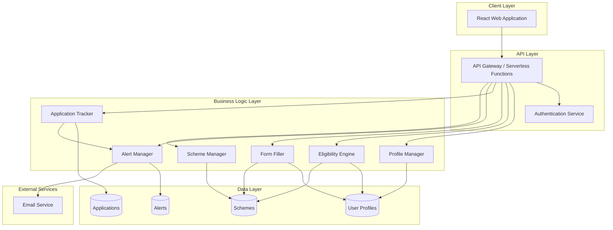

# Design Document: BureauBridge

## Overview

BureauBridge is a web-based platform that connects MSMEs and farmers with relevant government schemes through intelligent matching, automated form filling, and application tracking. The system is designed as a hackathon MVP with a focus on demonstrating core value within 24-48 hours.

### Architecture Philosophy

The design follows a serverless, cloud-native approach optimized for rapid development and demo stability:

- **Frontend-first**: Rich client application handling most UI logic
- **Serverless backend**: Stateless API functions for scalability and simplicity
- **Document-based storage**: NoSQL database for flexible schema and fast development
- **Mock integrations**: Simulated government systems for demo purposes

### Technology Stack Recommendation

- **Frontend**: React with TypeScript, Tailwind CSS for rapid UI development
- **Backend**: Node.js serverless functions (AWS Lambda, Vercel Functions, or similar)
- **Database**: MongoDB or DynamoDB for document storage
- **Authentication**: JWT-based auth with simple email/password
- **Hosting**: Vercel, Netlify, or AWS Amplify for integrated deployment
- **Email**: SendGrid or AWS SES for notifications

## Architecture

### System Architecture



### Component Responsibilities

**Profile Manager**
- Create, read, update user profiles
- Validate profile data completeness
- Handle MSME vs Farmer profile types

**Eligibility Engine**
- Match user profiles against scheme criteria
- Calculate relevance scores
- Rank and filter matching schemes

**Form Filler**
- Map profile fields to application form fields
- Pre-populate form data
- Handle field type conversions

**Application Tracker**
- Store submitted applications
- Retrieve application history
- Update application status
- Generate reference numbers

**Alert Manager**
- Generate alerts for status changes
- Generate deadline reminders
- Manage alert read/unread state
- Send email notifications

**Scheme Manager**
- CRUD operations for schemes
- Bulk import scheme data
- Version history tracking
- Search and filter schemes

## Components and Interfaces

### API Endpoints

#### Authentication
```
POST /api/auth/register
POST /api/auth/login
POST /api/auth/logout
GET  /api/auth/me
```

#### User Profiles
```
POST   /api/profiles          - Create profile
GET    /api/profiles/:userId  - Get profile
PUT    /api/profiles/:userId  - Update profile
DELETE /api/profiles/:userId  - Delete profile
```

#### Schemes
```
GET  /api/schemes              - List all schemes (with filters)
GET  /api/schemes/:schemeId    - Get scheme details
GET  /api/schemes/match        - Get matched schemes for current user
POST /api/schemes/search       - Search schemes
```

#### Applications
```
POST /api/applications                    - Submit application
GET  /api/applications                    - List user's applications
GET  /api/applications/:applicationId     - Get application details
PUT  /api/applications/:applicationId     - Update application status (demo)
GET  /api/applications/:applicationId/pdf - Download PDF
```

#### Alerts
```
GET    /api/alerts              - List user's alerts
PUT    /api/alerts/:alertId     - Mark alert as read
DELETE /api/alerts/:alertId     - Dismiss alert
GET    /api/alerts/unread/count - Get unread count
```

#### Admin (Demo)
```
POST /api/admin/schemes           - Create scheme
PUT  /api/admin/schemes/:id       - Update scheme
POST /api/admin/schemes/import    - Bulk import
POST /api/admin/demo/reset        - Reset demo data
POST /api/admin/demo/trigger      - Trigger status change
```

### Core Interfaces

#### User Profile Interface
```typescript
interface UserProfile {
  userId: string;
  email: string;
  userType: 'MSME' | 'FARMER';
  createdAt: Date;
  updatedAt: Date;
  
  // MSME-specific fields
  msmeData?: {
    businessName: string;
    businessType: string;
    industry: string;
    location: {
      state: string;
      district: string;
      pincode: string;
    };
    annualRevenue: number;
    numberOfEmployees: number;
    registrationNumber?: string;
    establishedYear: number;
  };
  
  // Farmer-specific fields
  farmerData?: {
    farmerName: string;
    farmSize: number; // in acres
    farmSizeUnit: 'ACRES' | 'HECTARES';
    location: {
      state: string;
      district: string;
      pincode: string;
    };
    cropTypes: string[];
    farmingMethod: 'ORGANIC' | 'CONVENTIONAL' | 'MIXED';
    landOwnership: 'OWNED' | 'LEASED' | 'SHARED';
    annualIncome?: number;
  };
}
```

#### Scheme Interface
```typescript
interface Scheme {
  schemeId: string;
  name: string;
  description: string;
  category: string;
  targetAudience: ('MSME' | 'FARMER')[];
  benefits: {
    type: 'SUBSIDY' | 'LOAN' | 'GRANT' | 'INSURANCE' | 'TRAINING';
    amount?: number;
    description: string;
  }[];
  eligibilityCriteria: {
    userType?: 'MSME' | 'FARMER';
    states?: string[];
    industries?: string[];
    cropTypes?: string[];
    minRevenue?: number;
    maxRevenue?: number;
    minFarmSize?: number;
    maxFarmSize?: number;
    minEmployees?: number;
    maxEmployees?: number;
  };
  requiredDocuments: string[];
  applicationForm: FormField[];
  deadline?: Date;
  isActive: boolean;
  createdAt: Date;
  updatedAt: Date;
  version: number;
}

interface FormField {
  fieldId: string;
  fieldName: string;
  fieldType: 'TEXT' | 'NUMBER' | 'DATE' | 'DROPDOWN' | 'FILE' | 'TEXTAREA';
  label: string;
  required: boolean;
  options?: string[]; // for dropdown
  validation?: {
    minLength?: number;
    maxLength?: number;
    min?: number;
    max?: number;
    pattern?: string;
  };
  mappingKey?: string; // maps to profile field
}
```

#### Application Interface
```typescript
interface Application {
  applicationId: string;
  referenceNumber: string;
  userId: string;
  schemeId: string;
  status: 'SUBMITTED' | 'UNDER_REVIEW' | 'APPROVED' | 'REJECTED' | 'MORE_INFO_NEEDED';
  formData: Record<string, any>;
  submittedAt: Date;
  updatedAt: Date;
  statusHistory: {
    status: string;
    timestamp: Date;
    note?: string;
  }[];
}
```

#### Alert Interface
```typescript
interface Alert {
  alertId: string;
  userId: string;
  type: 'STATUS_CHANGE' | 'DEADLINE_REMINDER' | 'SYSTEM';
  title: string;
  message: string;
  relatedApplicationId?: string;
  relatedSchemeId?: string;
  isRead: boolean;
  createdAt: Date;
  readAt?: Date;
}
```

### Eligibility Matching Algorithm

The Eligibility Engine uses a rule-based scoring system:

```typescript
function calculateEligibilityScore(
  profile: UserProfile,
  scheme: Scheme
): number {
  let score = 0;
  const criteria = scheme.eligibilityCriteria;
  
  // User type match (required)
  if (criteria.userType && criteria.userType !== profile.userType) {
    return 0; // Not eligible
  }
  
  // Location match
  if (criteria.states) {
    const userState = profile.userType === 'MSME' 
      ? profile.msmeData?.location.state 
      : profile.farmerData?.location.state;
    if (criteria.states.includes(userState)) {
      score += 30;
    } else {
      return 0; // Location mismatch is disqualifying
    }
  }
  
  // MSME-specific criteria
  if (profile.userType === 'MSME' && profile.msmeData) {
    // Industry match
    if (criteria.industries?.includes(profile.msmeData.industry)) {
      score += 25;
    }
    
    // Revenue range
    if (criteria.minRevenue !== undefined || criteria.maxRevenue !== undefined) {
      const revenue = profile.msmeData.annualRevenue;
      if ((criteria.minRevenue === undefined || revenue >= criteria.minRevenue) &&
          (criteria.maxRevenue === undefined || revenue <= criteria.maxRevenue)) {
        score += 20;
      } else {
        return 0; // Revenue out of range
      }
    }
    
    // Employee count
    if (criteria.minEmployees !== undefined || criteria.maxEmployees !== undefined) {
      const employees = profile.msmeData.numberOfEmployees;
      if ((criteria.minEmployees === undefined || employees >= criteria.minEmployees) &&
          (criteria.maxEmployees === undefined || employees <= criteria.maxEmployees)) {
        score += 15;
      }
    }
  }
  
  // Farmer-specific criteria
  if (profile.userType === 'FARMER' && profile.farmerData) {
    // Crop type match
    if (criteria.cropTypes) {
      const matchingCrops = profile.farmerData.cropTypes.filter(
        crop => criteria.cropTypes.includes(crop)
      );
      if (matchingCrops.length > 0) {
        score += 25;
      }
    }
    
    // Farm size range
    if (criteria.minFarmSize !== undefined || criteria.maxFarmSize !== undefined) {
      const farmSize = profile.farmerData.farmSize;
      if ((criteria.minFarmSize === undefined || farmSize >= criteria.minFarmSize) &&
          (criteria.maxFarmSize === undefined || farmSize <= criteria.maxFarmSize)) {
        score += 20;
      } else {
        return 0; // Farm size out of range
      }
    }
  }
  
  // Deadline proximity bonus
  if (scheme.deadline) {
    const daysUntilDeadline = Math.floor(
      (scheme.deadline.getTime() - Date.now()) / (1000 * 60 * 60 * 24)
    );
    if (daysUntilDeadline > 0 && daysUntilDeadline <= 30) {
      score += 10;
    }
  }
  
  return Math.min(score, 100); // Cap at 100
}
```

### Form Auto-Fill Mapping

The Form Filler uses a mapping configuration to connect profile fields to form fields:

```typescript
const FIELD_MAPPINGS: Record<string, string> = {
  // MSME mappings
  'business_name': 'msmeData.businessName',
  'business_type': 'msmeData.businessType',
  'industry': 'msmeData.industry',
  'state': 'msmeData.location.state',
  'district': 'msmeData.location.district',
  'pincode': 'msmeData.location.pincode',
  'annual_revenue': 'msmeData.annualRevenue',
  'number_of_employees': 'msmeData.numberOfEmployees',
  'registration_number': 'msmeData.registrationNumber',
  'established_year': 'msmeData.establishedYear',
  
  // Farmer mappings
  'farmer_name': 'farmerData.farmerName',
  'farm_size': 'farmerData.farmSize',
  'farm_size_unit': 'farmerData.farmSizeUnit',
  'crop_types': 'farmerData.cropTypes',
  'farming_method': 'farmerData.farmingMethod',
  'land_ownership': 'farmerData.landOwnership',
  'annual_income': 'farmerData.annualIncome',
  
  // Common mappings
  'email': 'email',
  'user_type': 'userType',
};

function autoFillForm(
  profile: UserProfile,
  formFields: FormField[]
): Record<string, any> {
  const filledData: Record<string, any> = {};
  
  for (const field of formFields) {
    if (field.mappingKey && FIELD_MAPPINGS[field.mappingKey]) {
      const profilePath = FIELD_MAPPINGS[field.mappingKey];
      const value = getNestedValue(profile, profilePath);
      
      if (value !== undefined && value !== null) {
        filledData[field.fieldId] = value;
      }
    }
  }
  
  return filledData;
}

function getNestedValue(obj: any, path: string): any {
  return path.split('.').reduce((current, key) => current?.[key], obj);
}
```

## Data Models

### Database Schema

#### Users Collection
```json
{
  "_id": "ObjectId",
  "userId": "string (UUID)",
  "email": "string (unique, indexed)",
  "passwordHash": "string",
  "userType": "MSME | FARMER",
  "createdAt": "ISODate",
  "updatedAt": "ISODate",
  "msmeData": {
    "businessName": "string",
    "businessType": "string",
    "industry": "string",
    "location": {
      "state": "string",
      "district": "string",
      "pincode": "string"
    },
    "annualRevenue": "number",
    "numberOfEmployees": "number",
    "registrationNumber": "string",
    "establishedYear": "number"
  },
  "farmerData": {
    "farmerName": "string",
    "farmSize": "number",
    "farmSizeUnit": "ACRES | HECTARES",
    "location": {
      "state": "string",
      "district": "string",
      "pincode": "string"
    },
    "cropTypes": ["string"],
    "farmingMethod": "ORGANIC | CONVENTIONAL | MIXED",
    "landOwnership": "OWNED | LEASED | SHARED",
    "annualIncome": "number"
  }
}
```

**Indexes:**
- `email` (unique)
- `userId` (unique)
- `userType`
- `msmeData.location.state`
- `farmerData.location.state`

#### Schemes Collection
```json
{
  "_id": "ObjectId",
  "schemeId": "string (UUID)",
  "name": "string (indexed)",
  "description": "string",
  "category": "string (indexed)",
  "targetAudience": ["MSME | FARMER"],
  "benefits": [{
    "type": "SUBSIDY | LOAN | GRANT | INSURANCE | TRAINING",
    "amount": "number",
    "description": "string"
  }],
  "eligibilityCriteria": {
    "userType": "MSME | FARMER",
    "states": ["string"],
    "industries": ["string"],
    "cropTypes": ["string"],
    "minRevenue": "number",
    "maxRevenue": "number",
    "minFarmSize": "number",
    "maxFarmSize": "number",
    "minEmployees": "number",
    "maxEmployees": "number"
  },
  "requiredDocuments": ["string"],
  "applicationForm": [{
    "fieldId": "string",
    "fieldName": "string",
    "fieldType": "TEXT | NUMBER | DATE | DROPDOWN | FILE | TEXTAREA",
    "label": "string",
    "required": "boolean",
    "options": ["string"],
    "validation": {
      "minLength": "number",
      "maxLength": "number",
      "min": "number",
      "max": "number",
      "pattern": "string"
    },
    "mappingKey": "string"
  }],
  "deadline": "ISODate",
  "isActive": "boolean",
  "createdAt": "ISODate",
  "updatedAt": "ISODate",
  "version": "number"
}
```

**Indexes:**
- `schemeId` (unique)
- `name` (text index for search)
- `category`
- `targetAudience`
- `isActive`
- `deadline`
- `eligibilityCriteria.states`
- `eligibilityCriteria.industries`
- `eligibilityCriteria.cropTypes`

#### Applications Collection
```json
{
  "_id": "ObjectId",
  "applicationId": "string (UUID)",
  "referenceNumber": "string (unique, indexed)",
  "userId": "string (indexed)",
  "schemeId": "string (indexed)",
  "status": "SUBMITTED | UNDER_REVIEW | APPROVED | REJECTED | MORE_INFO_NEEDED",
  "formData": {
    "encrypted": "string"
  },
  "submittedAt": "ISODate",
  "updatedAt": "ISODate",
  "statusHistory": [{
    "status": "string",
    "timestamp": "ISODate",
    "note": "string"
  }]
}
```

**Indexes:**
- `applicationId` (unique)
- `referenceNumber` (unique)
- `userId`
- `schemeId`
- `status`
- `submittedAt`
- Compound: `userId + status`

#### Alerts Collection
```json
{
  "_id": "ObjectId",
  "alertId": "string (UUID)",
  "userId": "string (indexed)",
  "type": "STATUS_CHANGE | DEADLINE_REMINDER | SYSTEM",
  "title": "string",
  "message": "string",
  "relatedApplicationId": "string",
  "relatedSchemeId": "string",
  "isRead": "boolean (indexed)",
  "createdAt": "ISODate",
  "readAt": "ISODate"
}
```

**Indexes:**
- `alertId` (unique)
- `userId`
- `isRead`
- Compound: `userId + isRead`
- `createdAt` (TTL index: 90 days)

### Data Encryption Strategy

**Sensitive Fields Requiring Encryption:**
- User profile: `annualRevenue`, `annualIncome`, `registrationNumber`
- Application: entire `formData` object

**Encryption Approach:**
- Use AES-256-GCM for field-level encryption
- Store encryption keys in environment variables or secret manager
- Encrypt before storing, decrypt after retrieval
- Use separate encryption keys for different data types

```typescript
import crypto from 'crypto';

const ENCRYPTION_KEY = process.env.ENCRYPTION_KEY; // 32 bytes
const ALGORITHM = 'aes-256-gcm';

function encrypt(text: string): string {
  const iv = crypto.randomBytes(16);
  const cipher = crypto.createCipheriv(ALGORITHM, Buffer.from(ENCRYPTION_KEY, 'hex'), iv);
  
  let encrypted = cipher.update(text, 'utf8', 'hex');
  encrypted += cipher.final('hex');
  
  const authTag = cipher.getAuthTag();
  
  return iv.toString('hex') + ':' + authTag.toString('hex') + ':' + encrypted;
}

function decrypt(encryptedText: string): string {
  const parts = encryptedText.split(':');
  const iv = Buffer.from(parts[0], 'hex');
  const authTag = Buffer.from(parts[1], 'hex');
  const encrypted = parts[2];
  
  const decipher = crypto.createDecipheriv(ALGORITHM, Buffer.from(ENCRYPTION_KEY, 'hex'), iv);
  decipher.setAuthTag(authTag);
  
  let decrypted = decipher.update(encrypted, 'hex', 'utf8');
  decrypted += decipher.final('utf8');
  
  return decrypted;
}
```

### Reference Number Generation

Application reference numbers follow the format: `BB-YYYY-XXXXXX`
- `BB`: BureauBridge prefix
- `YYYY`: Current year
- `XXXXXX`: 6-digit sequential number

```typescript
function generateReferenceNumber(): string {
  const year = new Date().getFullYear();
  const random = Math.floor(100000 + Math.random() * 900000);
  return `BB-${year}-${random}`;
}
```


## Correctness Properties

A property is a characteristic or behavior that should hold true across all valid executions of a system—essentially, a formal statement about what the system should do. Properties serve as the bridge between human-readable specifications and machine-verifiable correctness guarantees.

### Profile Management Properties

**Property 1: Profile validation rejects incomplete data**
*For any* user profile submission with missing required fields, the validation function should reject the profile and return error indicators for each missing field.
**Validates: Requirements 1.4**

**Property 2: Profile persistence round-trip**
*For any* valid user profile, saving the profile then retrieving it by userId should return an equivalent profile with all data preserved.
**Validates: Requirements 1.6**

**Property 3: Profile updates are persisted**
*For any* existing user profile and any valid update data, updating the profile then retrieving it should return the profile with the updated values.
**Validates: Requirements 1.8**

### Scheme Discovery and Matching Properties

**Property 4: Eligibility matching respects criteria**
*For any* user profile and scheme, if the scheme is returned as a match, then the profile must satisfy all mandatory eligibility criteria (userType, location, revenue range, farm size range, etc.).
**Validates: Requirements 2.2**

**Property 5: Matched schemes are ranked by score**
*For any* user profile and set of matched schemes, the returned list should be ordered by relevance score in descending order (highest score first).
**Validates: Requirements 2.3**

**Property 6: Scheme rendering includes required fields**
*For any* scheme, the rendered output (list view or detail view) should contain all required fields: name, description, benefits, eligibility criteria, deadline, and required documents.
**Validates: Requirements 2.4, 2.5**

**Property 7: Match scores are bounded**
*For any* matched scheme, the relevance score should be a number between 0 and 100 inclusive.
**Validates: Requirements 2.6**

**Property 8: Scheme filtering returns only matching schemes**
*For any* filter criteria (category, deadline range, benefit amount) and scheme set, all returned schemes should match the specified filter criteria.
**Validates: Requirements 2.8**

### Form Auto-Fill Properties

**Property 9: Auto-fill maps profile to form fields**
*For any* user profile and application form definition, all form fields with a mappingKey that exists in the profile should be pre-populated with the corresponding profile value.
**Validates: Requirements 3.2**

**Property 10: Auto-fill handles field type conversions**
*For any* form field type (TEXT, NUMBER, DATE, DROPDOWN) and corresponding profile value, the auto-fill function should correctly convert and populate the value in the appropriate format.
**Validates: Requirements 3.8**

**Property 11: Form validation rejects incomplete submissions**
*For any* application form submission with missing required fields, the validation function should reject the submission and indicate which fields are missing.
**Validates: Requirements 3.7, 4.1, 4.2**

### Application Submission Properties

**Property 12: Reference numbers are unique**
*For any* set of applications, all reference numbers should be unique (no duplicates).
**Validates: Requirements 4.3**

**Property 13: Stored applications contain required metadata**
*For any* stored application, it should contain userId, schemeId, referenceNumber, submittedAt timestamp, and status fields.
**Validates: Requirements 4.4**

**Property 14: New applications have SUBMITTED status**
*For any* newly created application, the initial status should be "SUBMITTED".
**Validates: Requirements 4.6**

**Property 15: Application data is encrypted**
*For any* stored application, the formData field should be encrypted (not plaintext) in the database.
**Validates: Requirements 4.7, 9.2**

**Property 16: PDF generation includes application data**
*For any* application, generating a PDF should produce a document that contains the application reference number, scheme name, submission date, and all form field values.
**Validates: Requirements 4.8**

### Application Tracking Properties

**Property 17: Users can only access their own applications**
*For any* user requesting applications, the returned list should contain only applications where userId matches the requesting user, and should not include other users' applications.
**Validates: Requirements 5.1, 9.4**

**Property 18: Application list rendering includes required fields**
*For any* application in the tracking dashboard, the rendered output should include scheme name, submission date, status, and reference number.
**Validates: Requirements 5.2**

**Property 19: Application status is always valid**
*For any* application, the status field should be one of the allowed values: "SUBMITTED", "UNDER_REVIEW", "APPROVED", "REJECTED", or "MORE_INFO_NEEDED".
**Validates: Requirements 5.3**

**Property 20: Application detail view includes complete information**
*For any* application detail view, the rendered output should include all form data, submission timestamp, current status, and status history.
**Validates: Requirements 5.4**

**Property 21: Application filtering returns only matching applications**
*For any* filter criteria (status, scheme category) and application set, all returned applications should match the specified filter.
**Validates: Requirements 5.5**

**Property 22: Application search returns matching results**
*For any* search query (reference number or scheme name) and application set, all returned applications should have the query string in either the reference number or associated scheme name.
**Validates: Requirements 5.6**

**Property 23: Deadline display includes unsubmitted schemes**
*For any* user with viewed schemes, if a scheme has a deadline within 30 days and the user has not submitted an application for it, the scheme should appear in the upcoming deadlines list.
**Validates: Requirements 5.8**

### Alert and Notification Properties

**Property 24: Status changes generate alerts**
*For any* application status change, an alert should be created for the application's userId with type "STATUS_CHANGE" and the relatedApplicationId set.
**Validates: Requirements 6.1**

**Property 25: Unread count matches unread alerts**
*For any* user, the unread alert count should equal the number of alerts where userId matches and isRead is false.
**Validates: Requirements 6.3**

**Property 26: Alerts contain required information**
*For any* alert, it should contain userId, type, title, message, createdAt timestamp, and isRead flag.
**Validates: Requirements 6.4**

**Property 27: Deadline alerts are generated for approaching deadlines**
*For any* scheme with a deadline within 7 days, if a user has viewed the scheme but has no application for it, a deadline alert should be generated for that user.
**Validates: Requirements 6.5**

**Property 28: Marking alerts as read updates state**
*For any* alert, after marking it as read, the isRead field should be true and readAt should contain a timestamp.
**Validates: Requirements 6.6**

**Property 29: Dismissed alerts are removed**
*For any* alert, after dismissal, it should not appear in the user's active alerts list.
**Validates: Requirements 6.7**

**Property 30: Email notifications are sent for critical changes**
*For any* critical status change (APPROVED, REJECTED), if email notifications are enabled for the user, an email should be sent with the alert details.
**Validates: Requirements 6.8**

### Scheme Management Properties

**Property 31: Stored schemes contain required fields**
*For any* stored scheme, it should contain schemeId, name, description, category, targetAudience, benefits, eligibilityCriteria, requiredDocuments, applicationForm, and isActive fields.
**Validates: Requirements 7.1**

**Property 32: Scheme creation and retrieval round-trip**
*For any* valid scheme, creating the scheme then retrieving it by schemeId should return an equivalent scheme with all data preserved.
**Validates: Requirements 7.2, 7.5**

**Property 33: Scheme updates are persisted**
*For any* existing scheme and valid update data, updating the scheme then retrieving it should return the scheme with the updated values.
**Validates: Requirements 7.3, 7.5**

**Property 34: Schemes can be marked inactive**
*For any* scheme, after marking it as inactive (isActive = false), retrieving the scheme should show isActive as false, and it should not appear in active scheme searches.
**Validates: Requirements 7.4**

**Property 35: Scheme validation rejects incomplete data**
*For any* scheme submission with missing required fields (name, description, category, eligibilityCriteria, applicationForm), the validation function should reject the scheme.
**Validates: Requirements 7.6**

**Property 36: Bulk import creates all valid schemes**
*For any* array of valid scheme objects, bulk importing should create all schemes, and each should be retrievable by its schemeId.
**Validates: Requirements 7.7**

**Property 37: Scheme updates increment version**
*For any* scheme update, the version number should increment by 1 from the previous version.
**Validates: Requirements 7.8**

### Search and Filter Properties

**Property 38: Search returns schemes matching query**
*For any* search query string and scheme set, all returned schemes should contain the query string (case-insensitive) in name, description, or category.
**Validates: Requirements 8.2**

**Property 39: Multiple filters are combined with AND logic**
*For any* combination of filter criteria (category, benefit type, deadline range), all returned schemes should match all specified filters simultaneously.
**Validates: Requirements 8.3, 8.4**

**Property 40: Result count matches actual results**
*For any* search or filter operation, the displayed count should equal the number of schemes in the results array.
**Validates: Requirements 8.5**

**Property 41: Clearing filters returns all active schemes**
*For any* filter state, after clearing all filters, the returned scheme list should contain all schemes where isActive is true.
**Validates: Requirements 8.6**

### Security and Privacy Properties

**Property 42: Sensitive profile fields are encrypted**
*For any* stored user profile with sensitive fields (annualRevenue, annualIncome, registrationNumber), those fields should be encrypted in the database.
**Validates: Requirements 9.1**

**Property 43: Rate limiting blocks excessive requests**
*For any* user or IP address, after N requests within a time window T, subsequent requests should be rejected with a rate limit error until the window expires.
**Validates: Requirements 9.7**

**Property 44: Data access is logged**
*For any* data access operation (read, write, update, delete), a log entry should be created with timestamp, userId, operation type, and resource identifier.
**Validates: Requirements 9.8**

### Demo Features Properties

**Property 45: Demo mode status updates trigger alerts**
*For any* application in demo mode, manually triggering a status update should change the application status and generate a corresponding alert for the user.
**Validates: Requirements 11.3, 11.4**

**Property 46: Statistics are calculated correctly**
*For any* dataset of users, schemes, and applications, the displayed statistics (total schemes, total applications, success rate) should match the actual counts and calculated percentages from the data.
**Validates: Requirements 11.5, 11.8**

**Property 47: Demo reset restores initial state**
*For any* demo session, after triggering reset, the system should return to the initial state with only seed data (sample profiles, schemes) and no user-generated applications or alerts.
**Validates: Requirements 11.7**

## Error Handling

### Error Categories

**Validation Errors**
- Missing required fields
- Invalid field formats (email, phone, dates)
- Out-of-range values (negative revenue, invalid status)
- Type mismatches

**Authentication Errors**
- Invalid credentials
- Expired sessions
- Unauthorized access attempts
- Missing authentication tokens

**Business Logic Errors**
- Applying to inactive schemes
- Duplicate applications for same scheme
- Profile type mismatch with scheme target audience
- Deadline passed for scheme

**System Errors**
- Database connection failures
- External service unavailability (email)
- Encryption/decryption failures
- File upload failures

### Error Response Format

All API errors follow a consistent format:

```typescript
interface ErrorResponse {
  error: {
    code: string;
    message: string;
    details?: Record<string, any>;
    timestamp: string;
  };
}
```

### Error Handling Strategies

**Validation Errors**: Return 400 Bad Request with specific field errors
```json
{
  "error": {
    "code": "VALIDATION_ERROR",
    "message": "Profile validation failed",
    "details": {
      "annualRevenue": "Annual revenue is required for MSME profiles",
      "location.state": "State is required"
    },
    "timestamp": "2024-01-15T10:30:00Z"
  }
}
```

**Authentication Errors**: Return 401 Unauthorized or 403 Forbidden
```json
{
  "error": {
    "code": "UNAUTHORIZED",
    "message": "Invalid or expired authentication token",
    "timestamp": "2024-01-15T10:30:00Z"
  }
}
```

**Business Logic Errors**: Return 422 Unprocessable Entity
```json
{
  "error": {
    "code": "SCHEME_INACTIVE",
    "message": "Cannot apply to inactive scheme",
    "details": {
      "schemeId": "scheme-123",
      "schemeName": "MSME Credit Guarantee Scheme"
    },
    "timestamp": "2024-01-15T10:30:00Z"
  }
}
```

**System Errors**: Return 500 Internal Server Error with generic message
```json
{
  "error": {
    "code": "INTERNAL_ERROR",
    "message": "An unexpected error occurred. Please try again later.",
    "timestamp": "2024-01-15T10:30:00Z"
  }
}
```

### Graceful Degradation

**Email Service Failure**: Store alert in database, log error, continue operation
**Database Read Failure**: Retry up to 3 times with exponential backoff
**Encryption Failure**: Log critical error, reject operation, alert administrators
**File Upload Failure**: Return clear error message, allow user to retry

### Client-Side Error Handling

**Network Errors**: Display "Connection lost" message with retry button
**Timeout Errors**: Display "Request timed out" with retry option
**Validation Errors**: Display inline field errors with clear guidance
**Session Expiration**: Redirect to login with message "Session expired, please log in again"

## Testing Strategy

### Dual Testing Approach

BureauBridge requires both unit testing and property-based testing for comprehensive coverage:

**Unit Tests** focus on:
- Specific examples demonstrating correct behavior
- Edge cases (empty arrays, null values, boundary conditions)
- Error conditions and exception handling
- Integration points between components
- Mock external services (email, database)

**Property-Based Tests** focus on:
- Universal properties that hold for all inputs
- Comprehensive input coverage through randomization
- Invariants that must always be true
- Round-trip properties (save/load, encrypt/decrypt)
- Relationship properties between components

### Property-Based Testing Configuration

**Framework**: Use `fast-check` for JavaScript/TypeScript property-based testing

**Test Configuration**:
- Minimum 100 iterations per property test
- Seed randomization for reproducibility
- Shrinking enabled to find minimal failing cases

**Test Tagging**: Each property test must reference its design document property
```typescript
// Feature: bureau-bridge, Property 2: Profile persistence round-trip
test('profile save and retrieve preserves all data', () => {
  fc.assert(
    fc.property(userProfileArbitrary, async (profile) => {
      const saved = await profileManager.save(profile);
      const retrieved = await profileManager.getById(saved.userId);
      expect(retrieved).toEqual(saved);
    }),
    { numRuns: 100 }
  );
});
```

### Test Data Generators

Property-based tests require generators (arbitraries) for domain objects:

```typescript
// User Profile Generator
const userProfileArbitrary = fc.record({
  userId: fc.uuid(),
  email: fc.emailAddress(),
  userType: fc.constantFrom('MSME', 'FARMER'),
  msmeData: fc.option(fc.record({
    businessName: fc.string({ minLength: 1, maxLength: 100 }),
    businessType: fc.constantFrom('PRIVATE', 'PUBLIC', 'PARTNERSHIP'),
    industry: fc.constantFrom('MANUFACTURING', 'SERVICES', 'RETAIL'),
    location: locationArbitrary,
    annualRevenue: fc.integer({ min: 0, max: 100000000 }),
    numberOfEmployees: fc.integer({ min: 1, max: 10000 }),
    establishedYear: fc.integer({ min: 1900, max: 2024 })
  })),
  farmerData: fc.option(fc.record({
    farmerName: fc.string({ minLength: 1, maxLength: 100 }),
    farmSize: fc.float({ min: 0.1, max: 10000, noNaN: true }),
    farmSizeUnit: fc.constantFrom('ACRES', 'HECTARES'),
    location: locationArbitrary,
    cropTypes: fc.array(fc.constantFrom('WHEAT', 'RICE', 'COTTON', 'SUGARCANE'), { minLength: 1 }),
    farmingMethod: fc.constantFrom('ORGANIC', 'CONVENTIONAL', 'MIXED'),
    landOwnership: fc.constantFrom('OWNED', 'LEASED', 'SHARED')
  }))
});

// Scheme Generator
const schemeArbitrary = fc.record({
  schemeId: fc.uuid(),
  name: fc.string({ minLength: 5, maxLength: 200 }),
  description: fc.string({ minLength: 10, maxLength: 1000 }),
  category: fc.constantFrom('FINANCE', 'SUBSIDY', 'TRAINING', 'INSURANCE'),
  targetAudience: fc.array(fc.constantFrom('MSME', 'FARMER'), { minLength: 1 }),
  benefits: fc.array(benefitArbitrary, { minLength: 1 }),
  eligibilityCriteria: eligibilityCriteriaArbitrary,
  requiredDocuments: fc.array(fc.string(), { minLength: 1 }),
  applicationForm: fc.array(formFieldArbitrary, { minLength: 1 }),
  isActive: fc.boolean(),
  deadline: fc.option(fc.date({ min: new Date(), max: new Date('2025-12-31') }))
});
```

### Unit Test Coverage Goals

- **Profile Manager**: 90%+ coverage
  - Profile creation with MSME data
  - Profile creation with Farmer data
  - Profile update
  - Profile retrieval
  - Validation error cases

- **Eligibility Engine**: 90%+ coverage
  - Matching with various criteria combinations
  - Score calculation edge cases
  - Empty scheme list
  - No matches found

- **Form Filler**: 90%+ coverage
  - Auto-fill with complete profile
  - Auto-fill with partial profile
  - Field type conversions
  - Unmapped fields remain empty

- **Application Tracker**: 90%+ coverage
  - Application submission
  - Status updates
  - Reference number generation
  - Application retrieval

- **Alert Manager**: 90%+ coverage
  - Alert generation on status change
  - Deadline alert generation
  - Mark as read
  - Alert dismissal

### Integration Testing

**API Integration Tests**:
- Test complete user journeys (register → profile → discover → apply → track)
- Test authentication flows
- Test error responses
- Test rate limiting

**Database Integration Tests**:
- Test CRUD operations with real database
- Test query performance
- Test index usage
- Test transaction handling

### Demo Testing Checklist

Before hackathon presentation:
- [ ] All API endpoints respond successfully
- [ ] Profile creation works for both MSME and Farmer
- [ ] Scheme matching returns relevant results
- [ ] Auto-fill populates form fields correctly
- [ ] Application submission generates reference number
- [ ] Tracking dashboard displays applications
- [ ] Alerts appear for status changes
- [ ] Search and filter work correctly
- [ ] Demo mode status updates work
- [ ] Demo reset restores initial state
- [ ] UI is responsive on mobile
- [ ] No console errors in browser
- [ ] All links and buttons work
- [ ] Loading states display correctly
- [ ] Error messages are user-friendly

### Performance Testing

**Load Testing**:
- Simulate 100 concurrent users
- Test API response times under load
- Monitor database query performance
- Check memory usage and leaks

**Benchmarks**:
- Homepage load: < 2 seconds
- Scheme matching: < 3 seconds
- Application submission: < 2 seconds
- Dashboard load: < 2 seconds

